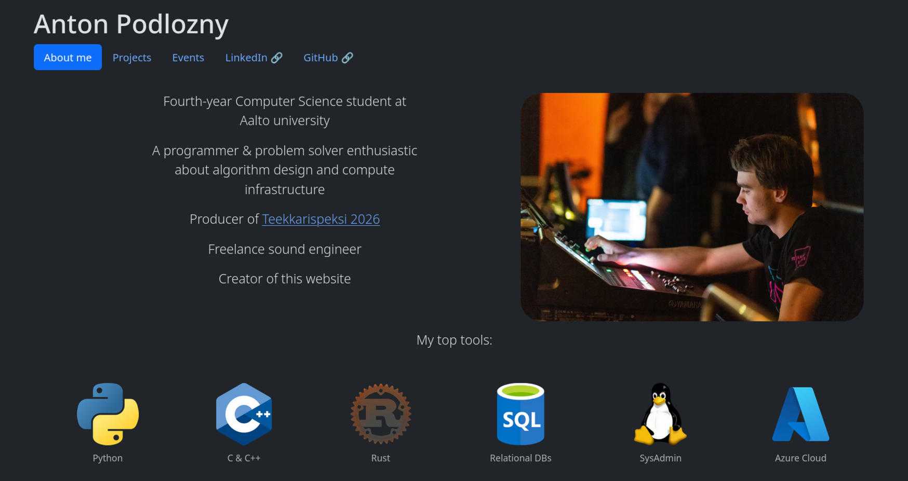

A personal website to act as a virtual business card.

Built with [Hugo](https://gohugo.io/) and modified [Paige theme](https://github.com/willfaught/paige). Hosted with Nginx & Cloudflare dynamic DNS on my home server, with the domain [antonpodlozny.com](https://antonpodlozny.com/).

See [COPYRIGHT.md](https://github.com/apodl1/antonpodlozny.com/blob/main/COPYRIGHT.md) for copyright and licensing information.
